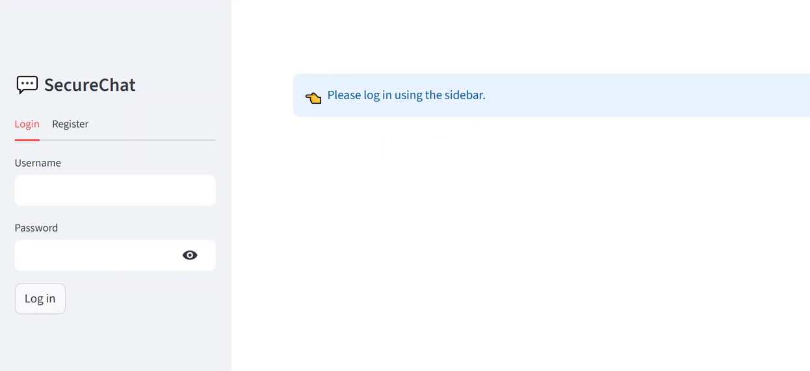
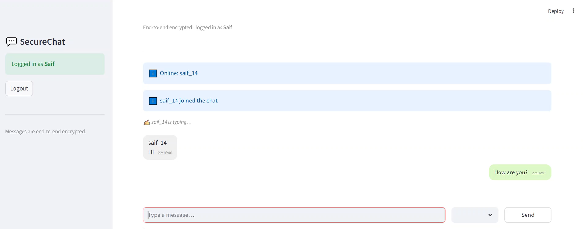
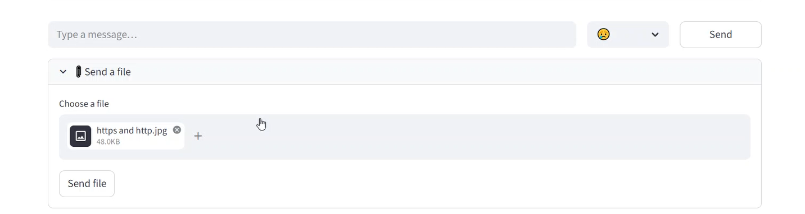
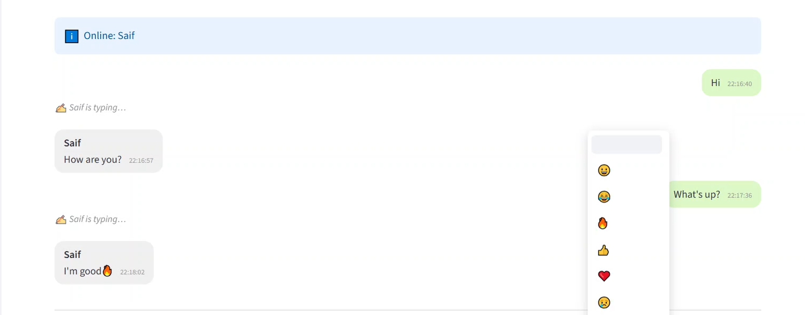
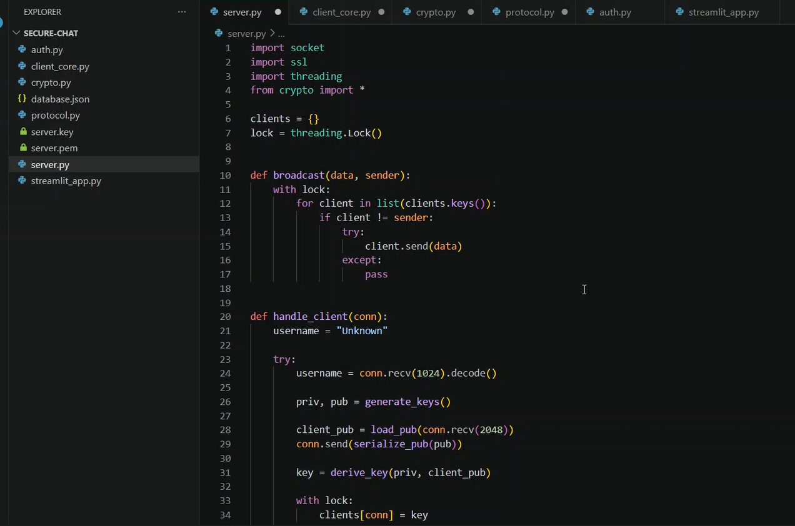

```
███████╗███████╗ ██████╗██╗   ██╗██████╗ ███████╗ ██████╗██╗  ██╗ █████╗ ████████╗
██╔════╝██╔════╝██╔════╝██║   ██║██╔══██╗██╔════╝██╔════╝██║  ██║██╔══██╗╚══██╔══╝
███████╗█████╗  ██║     ██║   ██║██████╔╝█████╗  ██║     ███████║███████║   ██║
╚════██║██╔══╝  ██║     ██║   ██║██╔══██╗██╔══╝  ██║     ██╔══██║██╔══██║   ██║
███████║███████╗╚██████╗╚██████╔╝██║  ██║███████╗╚██████╗██║  ██║██║  ██║   ██║
╚══════╝╚══════╝ ╚═════╝ ╚═════╝ ╚═╝  ╚═╝╚══════╝ ╚═════╝╚═╝  ╚═╝╚═╝  ╚═╝   ╚═╝
```

<div align="center">

**A secure multi-client messaging platform built with TLS, AES-GCM encryption, ECDH key exchange, and real-time socket communication.**

<br>


</div>

<br>

---

## Overview

SecureChat is a production-inspired encrypted messaging application developed in Python that enables secure, real-time communication between multiple users through a client-server architecture.

The system implements TLS-secured socket communication, AES-GCM message encryption, and ECDH key exchange for end-to-end security. It supports user authentication, file sharing, typing indicators, online/offline presence tracking, and a modern Streamlit-based interface — simulating the architecture and security standards expected in production-grade messaging systems.

This project was developed as part of a cybersecurity internship to apply and deepen practical knowledge in encryption systems, secure networking, authentication mechanisms, and security-focused software development.

<br>

---

<br>

```
═══════════════════════════════════════════════════════
  OBJECTIVES
═══════════════════════════════════════════════════════
```

- Design and implement a secure real-time communication system from the ground up
- Apply end-to-end encryption using industry-standard cryptographic primitives
- Protect message confidentiality and integrity across the network layer
- Support multiple concurrent clients through a robust server architecture
- Build a complete authentication system with secure credential storage
- Handle encrypted file transfer between authenticated users
- Deliver a functional, modern user interface for real-world usability
- Simulate the security architecture of production-grade messaging platforms

<br>

---

<br>

```
═══════════════════════════════════════════════════════
  FEATURES
═══════════════════════════════════════════════════════
```

| Feature | Description |
|---|---|
| End-to-End Encryption | Every message is encrypted with AES-GCM before transmission |
| TLS Secure Communication | All socket traffic is wrapped with TLS using OpenSSL certificates |
| ECDH Key Exchange | Symmetric session keys are derived securely per connection |
| Multi-Client Messaging | Concurrent users handled with threaded server architecture |
| Authentication System | Registration and login with PBKDF2-hashed credentials |
| File Sharing | Secure transfer of files over encrypted channels |
| Typing Indicators | Real-time presence signals between connected clients |
| Emoji Support | Full unicode emoji rendering within the chat interface |
| Online/Offline Status | Live user presence tracking across the server |
| Real-Time Messaging | Low-latency broadcast communication between all active clients |

<br>

---

<br>

```
═══════════════════════════════════════════════════════
  IMPLEMENTATION
═══════════════════════════════════════════════════════
```

<br>

### 1. Authentication System

User credentials are handled through a dedicated authentication module (`auth.py`) that manages registration, login validation, and secure password storage.

- **Registration** — New users provide a username and password. The server validates uniqueness before storing credentials.
- **Login** — Users authenticate against stored records with hash comparison.
- **Password Hashing** — All passwords are hashed using PBKDF2-HMAC with SHA-256, a random salt, and a high iteration count before being written to `database.json`. Plaintext passwords are never stored or transmitted.

<br>

### 2. Secure Communication Layer

All client-server communication is transmitted over a TLS-secured socket channel.

- **TLS Implementation** — Python's `ssl` module wraps raw TCP sockets, enforcing encrypted transport for all data in transit.
- **SSL Certificates** — Self-signed certificates are generated with OpenSSL (RSA-4096) and loaded by the server at startup.
- **Secure Sockets** — Both the server and client enforce SSL context parameters, preventing plaintext fallback and man-in-the-middle exposure.

<br>

### 3. Encryption Architecture

Message-level security is implemented on top of the transport layer through `crypto.py`.

- **ECDH Key Exchange** — Upon connection, the client and server perform an Elliptic Curve Diffie-Hellman handshake to derive a shared session key without transmitting secret material.
- **AES-GCM Encryption** — Messages are encrypted using AES in Galois/Counter Mode, which provides both confidentiality and authenticated integrity verification.
- **Secure IV/Nonce Handling** — A unique nonce is generated for every message encryption operation, ensuring ciphertext non-reuse even under the same session key.

<br>

### 4. Real-Time Messaging

The server manages multiple simultaneous clients using Python's threading model.

- **Multi-Client Communication** — Each client connection is assigned a dedicated thread upon authentication, allowing full concurrency without blocking.
- **Broadcast Architecture** — Server-side message routing broadcasts transmissions to all connected and authenticated clients in real time.
- **Thread Handling** — Thread lifecycle is managed carefully to handle disconnections, exceptions, and clean shutdown without resource leakage.

<br>

### 5. UI Layer

The user interface is built with Streamlit to provide a clean and accessible chat experience.

- **Chat Interface** — A scrollable message window displays the full conversation history with sender identification.
- **File Uploads** — Users can attach and send files directly through the Streamlit upload component.
- **Typing Indicators** — A lightweight signaling protocol broadcasts typing state to other connected clients.
- **Emoji Support** — The interface renders unicode emoji within message content natively.
- **Online/Offline Status** — A live status panel reflects the current presence of all registered users.

<br>

---

<br>

```
═══════════════════════════════════════════════════════
  PROJECT STRUCTURE
═══════════════════════════════════════════════════════
```

```
secure-chat/
│
│── server.py              # Core server — socket handling, threading, message routing
│── client_core.py         # Client networking logic and event management
│── crypto.py              # ECDH key exchange, AES-GCM encryption/decryption
│── protocol.py            # Message serialization and protocol definitions
│── auth.py                # User registration, login, PBKDF2 password hashing
│── streamlit_app.py       # Streamlit frontend — chat UI, file upload, status
│── database.json          # Persistent user credential storage
│── server.pem             # TLS certificate (generated via OpenSSL)
│── server.key             # TLS private key (generated via OpenSSL)
│── Screenshots/           # UI screenshots for documentation
│── README.md
```

<br>

---

<br>

```
═══════════════════════════════════════════════════════
  SCREENSHOTS
═══════════════════════════════════════════════════════
```

<br>

### Authentication



<br>

### Real-Time Messaging



<br>

### File Support



<br>

### Emoji Support



<br>

### Modular Structure



<br>

---

<br>

```
═══════════════════════════════════════════════════════
  SETUP & USAGE
═══════════════════════════════════════════════════════
```

<br>

**Install Dependencies**

```bash
pip install streamlit cryptography
```

<br>

**Generate SSL Certificates**

```bash
openssl req -x509 -newkey rsa:4096 -keyout server.key -out server.pem -days 365 -nodes
```

<br>

**Run the Server**

```bash
python server.py
```

<br>

**Launch the Frontend**

```bash
streamlit run streamlit_app.py
```

<br>

---

<br>

```
═══════════════════════════════════════════════════════
  CONCLUSION
═══════════════════════════════════════════════════════
```

This project represents a complete, end-to-end implementation of a secure messaging system built on real cryptographic principles and production-relevant architecture.

Through this work, the following areas were explored and applied in depth:

- **Cryptographic Systems** — Practical implementation of ECDH, AES-GCM, IV management, and PBKDF2 hashing in a working application context
- **Secure Networking** — TLS configuration, certificate management, and encrypted socket programming using Python's standard and third-party libraries
- **Authentication Engineering** — Design of a credential system with secure storage, salted hashing, and session management
- **Concurrent Server Design** — Multi-threaded architecture capable of handling multiple simultaneous authenticated clients
- **Real-World Security Simulation** — The overall system reflects the layered security model applied in production messaging applications, combining transport-layer and application-layer protections

SecureChat demonstrates that strong security practices and functional, user-facing software are not mutually exclusive — and that building secure systems from scratch is one of the most effective ways to internalize the principles that protect real communication at scale.

<br>

---

<div align="center">

*Developed as a Cybersecurity Internship Project at **SyntecxHub** — Security Engineering*

</div>
